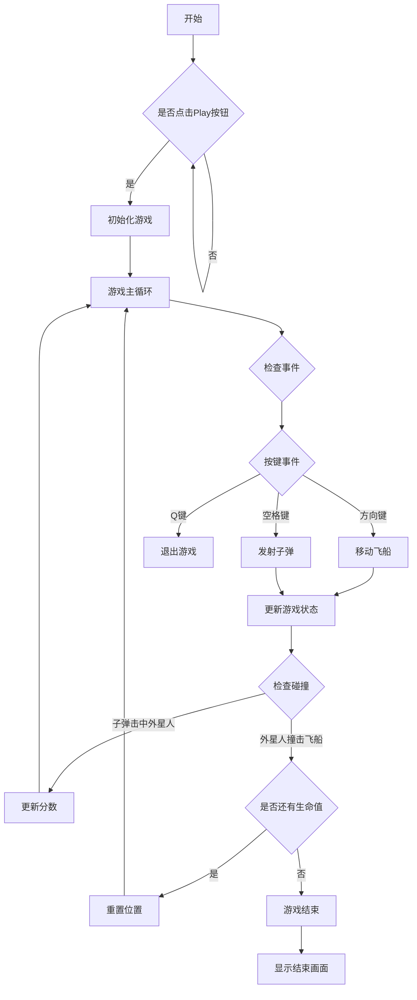
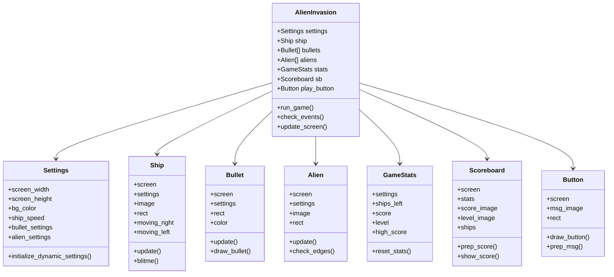

# 实验二 外星人入侵游戏开发

班级： 22物联2

学号： 20220305211

姓名： 李德喜

Github地址：<https://github.com/YosparNa/python_alien_invasion/tree/dev1>

---

## 实验目的

1. Python基础：Python基础语法、Python标准库
2. Pygame的使用
3. 使用Git进行版本控制和团队协作

## 实验环境

1. Git
2. VSCode
3. VSCode插件

## 实验项目分工协作情况

### 项目组员

### 项目分工

- 谭伟阳：负责游戏的主要逻辑开发
- 李德喜：负责游戏的界面设计
- 肖昊：负责整合代码
- 彭哲：负责代码的审查（Review）和测试工作

## 实验过程记录

### 1. 游戏界面设计概述

作为负责游戏界面设计的成员，我主要完成了以下工作：
- 设计并实现了游戏主界面布局
- 实现了记分板显示系统
- 设计了游戏开始按钮和游戏结束界面
- 优化了游戏视觉元素的显示效果

### 2. 游戏流程图



### 3. 界面设计实现细节

#### 3.1 主界面布局设计
主界面采用了简洁的设计风格，主要包含以下元素：
- 顶部显示得分信息和等级
- 中央为游戏主要活动区域
- 左上角显示剩余生命值
- 游戏未开始时显示Play按钮

关键代码实现：
```python
def update_screen(self):
   """更新屏幕上的图像，并切换到新屏幕"""
   self.screen.fill(self.settings.bg_color)
   self.ship.blitme()
   for bullet in self.bullets.sprites():
   bullet.draw_bullet()
   self.aliens.draw(self.screen)
   self.sb.show_score()
   if not self.game_active:
   self.play_button.draw_button()
   pygame.display.flip()
```
#### 3.2 记分板系统设计
记分板设计包含以下信息：
- 当前得分
- 最高分
- 当前等级
- 剩余生命值（以飞船图标显示）

实现代码：
```python
def prep_score(self):
   """将得分渲染为图像"""
   rounded_score = round(self.stats.score, -1)
   score_str = f"{rounded_score:,}"
   self.score_image = self.font.render(score_str, True,
   self.text_color, self.settings.bg_color)
```
#### 3.3 按钮设计
设计了一个醒目的Play按钮：
- 使用绿色背景
- 白色文字
- 居中显示
- 鼠标悬停效果

关键代码实现：
```python
def init(self, ai_game, msg):
   """初始化按钮的属性"""
   self.width, self.height = 200, 50
   self.button_color = (0, 135, 0)
   self.text_color = (255, 255, 255)
   self.font = pygame.font.SysFont(None, 48)
```
#### 3.4 游戏结束界面
当游戏结束时，显示：
- "GAME OVER"文字
- 最终得分
- 退出提示

关键代码实现：
```python
def game_over(self):
   """显示游戏结束"""
   self.game_active = False
   font = pygame.font.SysFont(None, 48)
   game_over_text = font.render("GAME OVER - Press Q to Quit", True, (255, 0, 0))
   text_rect = game_over_text.get_rect()
   text_rect.center = self.screen.get_rect().center
   self.screen.blit(game_over_text, text_rect)
```
### 4. 界面优化措施

1. 色彩搭配
   - 使用柔和的灰色背景(230, 230, 230)
   - 醒目的按钮颜色
   - 清晰的文字显示

2. 布局优化
   - 合理利用屏幕空间
   - 重要信息醒目显示
   - 保持界面整洁

3. 交互体验
   - 添加按钮点击反馈
   - 平滑的动画效果
   - 清晰的游戏状态提示

4. 性能优化
   - 使用精灵组进行批量渲染
   - 优化图像加载方式
   - 控制刷新率为60FPS
### 5. 游戏类结构图

## 实验总结

通过参与外星人入侵游戏的界面设计工作，我获得了以下几个方面的收获：

### 1. 编程工具使用
- 熟练使用 VSCode 进行 Python 开发
- 掌握了 Git 版本控制的基本操作
- 学会使用 Pygame 库进行游戏开发

### 2. Python 编程技能
- 深入理解了 Python 的面向对象编程
- 掌握了 Python 类的继承和多态特性
- 学会了使用 Python 处理事件和用户输入
- 理解了 Python 模块化编程的重要性

### 3. 游戏开发知识
- 学习了游戏循环的基本结构
- 掌握了精灵（Sprite）的概念和使用
- 理解了游戏碰撞检测的实现方法
- 学会了游戏状态管理和场景切换

### 4. 界面设计技巧
- 掌握了基本的用户界面设计原则
- 学会了使用 Pygame 进行图形渲染
- 理解了游戏界面布局的重要性
- 掌握了动画效果的实现方法

### 5. 团队协作能力
- 学会了在团队中明确分工和责任
- 掌握了代码版本控制的协作流程
- 提高了技术文档的编写能力
- 增强了与团队成员的沟通能力

### 6. 编程思想提升
- 理解了模块化设计的重要性
- 掌握了代码复用和维护的技巧
- 学会了性能优化的基本方法
- 提高了代码的可读性和可维护性

这次实验不仅让我掌握了具体的编程技能，更重要的是学会了如何在团队中协作完成一个完整的项目。通过实践，我对软件开发的整个流程有了更深入的理解，这些经验对我未来的学习和工作都很有帮助。